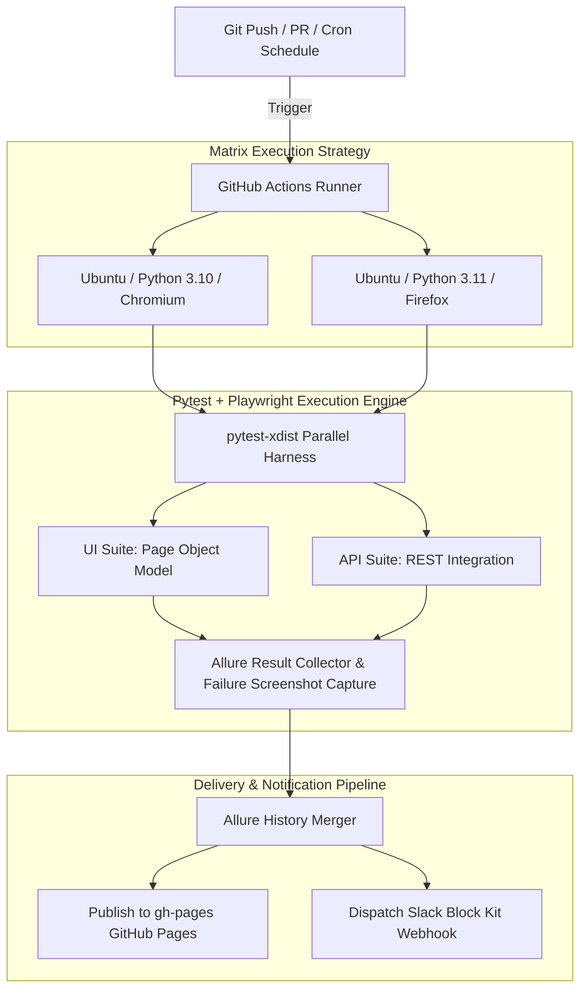

# ApexQA-Engine | Enterprise Full-Stack UI & REST API Test Automation Framework

[](https://github.com/YOUR_GITHUB_USERNAME/ApexQA-Engine/actions)
[](https://YOUR_GITHUB_USERNAME.github.io/ApexQA-Engine/)
[](https://www.python.org/)
[](https://playwright.dev/python/)
[](https://docs.pytest.org/)
[](https://slack.com/)
[](https://opensource.org/licenses/MIT)

**Production-ready, highly parallelized automated testing harness combining Web UI browser automation and REST API endpoint validation into a unified continuous delivery pipeline.**

---

## Table of Contents

- [Executive Overview](#executive-overview)
- [Key Highlights & Enterprise Features](#key-highlights--enterprise-features)
- [System Architecture & Workflow Pipeline](#system-architecture--workflow-pipeline)
- [Inputs & Outputs](#inputs--outputs)
- [Repository Directory Map](#repository-directory-map)
- [Quickstart - Running Locally](#quickstart---running-locally)
  - [1. Prerequisites](#1-prerequisites)
  - [2. Environment Setup](#2-environment-setup)
  - [3. Running Test Suites](#3-running-test-suites)
  - [4. Generating & Viewing Allure Reports](#4-generating--viewing-allure-reports)
- [CI/CD Pipeline & GitHub Secrets Setup](#cicd-pipeline--github-secrets-setup)
- [Quality Gates & Branch Protection Strategy](#quality-gates--branch-protection-strategy)
- [Troubleshooting & FAQ](#troubleshooting--faq)
- [License](#license)

---

## Executive Overview

**ApexQA-Engine** is a robust, enterprise-grade test automation framework designed to solve modern software quality assurance challenges. It bridges the gap between front-end user interface automation and back-end REST service validation by running both within a unified **Python + Pytest** execution engine.

By implementing strict software architecture principles—including the **Page Object Model (POM)** pattern, multi-CPU parallelization via `pytest-xdist`, dynamic failure screenshot/DOM capture, and automated report publishing—ApexQA-Engine ensures rapid, flaky-resistant execution across both developer workstations and cloud CI/CD pipelines.

---

## Key Highlights & Enterprise Features

* **Page Object Model (POM)**: Completely separates UI element locators and page interaction logic from test assertions (`pages/base_page.py`, `pages/login_page.py`, `pages/checkout_page.py`), driving high code maintainability and modularity.
* **Unified UI & API Testing Surface**: Seamlessly runs web browser workflows via **Playwright** and backend REST API checks via **`requests`** inside a single test harness.
* **Multi-Core Parallel Execution**: Utilizes `pytest-xdist` to execute tests across multiple CPU worker threads concurrently (`pytest -n auto`), cutting test suite runtimes by **>50%**.
* **Cross-Browser & Python Version Matrix**: Automated GitHub Actions workflow executes tests across **Python 3.10** & **3.11** as well as **Chromium** and **Firefox** browser engines.
* **Self-Healing Failure Diagnostics**: `conftest.py` hooks automatically catch test failures in real-time, taking full-page screenshots and capturing raw DOM HTML source code directly into Allure report attachments.
* **Live Allure Dashboard on GitHub Pages**: Merges historical test results across matrix runs and auto-publishes interactive HTML reports with trend graphs to the `gh-pages` branch.
* **ChatOps Alerting via Slack Block Kit**: Sends rich Slack notification cards after every pipeline run displaying pass/fail/skip totals, duration, commit SHA, and direct hyperlinks to the live report.

---

## System Architecture & Workflow Pipeline



---

## Inputs & Outputs

### Inputs

1. **Trigger Events**:
   * Code push or Pull Request targeting `main` or `develop` branches.
   * Scheduled nightly regression runs (`02:00 UTC` cron).
   * Manual developer execution via CLI.
2. **Environment & Configuration Parameters** (`utils/config.py`, `pytest.ini`):
   * Base URLs for Web UI (e.g., SauceDemo / E-Commerce target) and REST API service (e.g., ReqRes API).
   * Default timeout thresholds and viewport resolution settings (`1280x720`).
   * Command-line flags (`-m ui`, `-m api`, `--headed`, `--browser chromium`).
3. **Secrets**:
   * `SLACK_WEBHOOK_URL` (Repository Secret for ChatOps notifications).
   * `REQRES_API_KEY` (API Authentication Token).

### Outputs

1. **Terminal Console Metrics**:
   * Execution status, test pass/fail counts, duration breakdown.
2. **Visual & Failure Artifacts**:
   * Full-page failure PNG screenshots automatically attached on test failure.
   * Full Page DOM HTML files saved for deep DOM inspection on assertion failures.
3. **Allure Interactive HTML Dashboard**:
   * Published live at `https://YOUR_GITHUB_USERNAME.github.io/ApexQA-Engine/`
   * Includes historical pass rate trend graphs, execution duration charts, and step-by-step debug traces.
4. **ChatOps Notifications (Slack)**:
   * Rich Slack Block Kit summary card dispatched to team channels.

---

## Repository Directory Map

```text
ApexQA-Engine/
├── .github/
│   └── workflows/
│       └── tests.yml            # CI/CD Pipeline definition (Matrix execution, Allure deploy, Slack notification)
├── pages/
│   ├── base_page.py            # Core Playwright wrapper methods with @allure.step logging
│   ├── login_page.py           # Page Object for Authentication Page workflows
│   └── checkout_page.py        # Page Object for Shopping Cart & Checkout validation
├── tests/
│   ├── ui/
│   │   ├── test_login.py       # Web UI Authentication & Error State Test Cases
│   │   └── test_checkout.py    # Web UI End-to-End E-Commerce Purchasing Test Cases
│   └── api/
│       └── test_endpoints.py   # REST API CRUD Endpoint Test Cases (GET, POST, PUT, DELETE)
├── utils/
│   ├── config.py               # Environment variables & centralized framework configuration
│   └── slack_notifier.py       # Slack Block Kit payload generator & HTTP Webhook dispatcher
├── conftest.py                 # Pytest hooks, failure screenshot attachment, DOM dumping & Allure env setup
├── pytest.ini                  # Pytest configuration, custom markers (ui, api), and logging defaults
├── requirements.txt            # Python dependencies (Playwright, Pytest, Allure-pytest, Requests)
├── PROJECT_DETAIL.md           # Deep-dive architecture & interview reference documentation
└── README.md                   # Complete framework README
```

---

## Quickstart - Running Locally

### 1. Prerequisites
* **Python**: 3.10 or 3.11 installed.
* **Git**: Installed on system.
* **Node / Allure CLI** *(Optional for local Allure HTML report rendering)*.

### 2. Environment Setup

```bash
# 1. Clone the repository
git clone https://github.com/YOUR_GITHUB_USERNAME/ApexQA-Engine.git
cd ApexQA-Engine

# 2. Create a virtual environment
# On Windows (PowerShell):
python -m venv venv
.\venv\Scripts\Activate

# On macOS / Linux:
python3 -m venv venv
source venv/bin/activate

# 3. Upgrade pip and install dependencies
pip install --upgrade pip
pip install -r requirements.txt

# 4. Install Playwright browser binaries & OS dependencies
python -m playwright install chromium firefox
```

### 3. Running Test Suites

```bash
# Run all tests in parallel across CPU cores with Allure data generation
pytest --alluredir=allure-results -n auto

# Run only Web UI tests
pytest -m ui

# Run only REST API tests
pytest -m api

# Run tests in headful mode (visible browser window for debugging)
pytest --headed --browser chromium tests/ui/test_login.py

# Run with custom verbosity and output logging
pytest -vv --log-cli-level=INFO
```

### 4. Generating & Viewing Allure Reports

If you have **Allure CLI** installed on your machine (`brew install allure` on macOS or via Scoop/Choco on Windows):

```bash
# Serve live interactive report in browser
allure serve allure-results

# Or generate static HTML report folder
allure generate allure-results --clean -o allure-report
```

---

## CI/CD Pipeline & GitHub Secrets Setup

The repository is pre-configured with GitHub Actions in `.github/workflows/tests.yml`.

### Setting Up Required GitHub Secrets:
1. Go to your GitHub repository: **Settings -> Secrets and variables -> Actions**.
2. Click **New repository secret** and add:
   * `SLACK_WEBHOOK_URL`: *(Your Slack incoming webhook URL for ChatOps alerts)*.
   * `REQRES_API_KEY`: *(Optional API key for REST endpoint tests)*.

### Enabling Live GitHub Pages Dashboard:
1. Go to **Settings -> Pages**.
2. Set **Build and deployment -> Source** to **Deploy from a branch**.
3. Select Branch: `gh-pages` and Folder: `/ (root)`.
4. Click **Save**. The dashboard will be updated automatically on every push!

---

## Quality Gates & Branch Protection Strategy

To maintain high code quality in production repositories, **ApexQA-Engine** recommends the following branch protection policy for `main` and `develop`:

1. **Require Pull Request Reviews**: Require at least **1 approval** before merging.
2. **Require Status Checks to Pass**:
   * Require `Run Tests (chromium / Python 3.11)` and `Run Tests (firefox / Python 3.10)` checks to pass green before merging.
3. **Restrict Direct Pushes**: Force pushes (`git push --force`) and branch deletions are disabled.

---

## Troubleshooting & FAQ

### Q: Playwright browser execution fails with missing browser binaries?
Run `python -m playwright install --with-deps` to re-download the required Chromium and Firefox binaries along with system dependencies.

### Q: `pytest-xdist` parallel execution issues on Windows?
Ensure all test files start with `test_` and fixtures defined in `conftest.py` follow correct pytest scoping (`session` vs `function`).

### Q: How to view failure screenshots locally?
When running `pytest --alluredir=allure-results`, screenshots are saved inside `allure-results/` as PNG files. Use `allure serve allure-results` to view them embedded inside the report visual interface.

---

## License


Distributed under the **MIT License**. See `LICENSE` for more information.